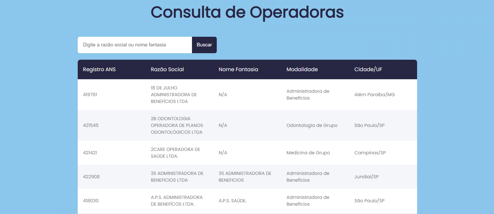

# Projeto Vue.js + Python: Consulta de Operadoras  

Este projeto consiste em uma interface web desenvolvida com **Vue.js** que interage com um servidor **Python** para realizar buscas textuais em uma lista de operadoras.




## Acesso ao Projeto  

- **Frontend (Vue.js):** [Clique aqui para acessar](https://operadoras-frontend.onrender.com/)  
- **Backend (API Python):** [Clique aqui para acessar](https://teste-nivelamento-kkbg.onrender.com)  


## 🚀 Como Executar o Projeto Localmente  

### 🔧 Configuração do Backend (Python)  

1. **Clone o repositório**  
   ```bash
   git clone https://github.com/lukaskardeck/teste-nivelamento.git

   cd teste4_API/backend
   ```  

2. **Instale as dependências**  
   ```bash
   pip install -r requirements.txt
   ```  

3. **Execute o servidor**  
   ```bash
   python app.py 
   ```  

### 🎨 Configuração do Frontend (Vue.js)  

1. **Navegue até a pasta do frontend**  
   ```bash
   cd teste4_API/frontend
   ```  

2. **Instale as dependências**  
   ```bash
   npm install
   ```  

3. **Inicie o servidor de desenvolvimento**  
   ```bash
   npm run dev
   ```  

4. **Acesse a interface web:**  
   Normalmente, estará disponível em: [http://localhost:5173](http://localhost:5173)

## Endpoints da API

1. **Rota principal**
```bash
GET /operadoras
```
Retorna a lista completa de operadoras cadastradas.

2. Buscar operadoras por nome ou razão social
```bash
GET /operadoras/busca?nome=<termo>
```

Retorna operadoras cujo Nome Fantasia ou Razão Social contenham o termo pesquisado.

## 📩 Coleção Postman  

A coleção de testes pode ser importada no Postman a partir do arquivo **requisicao_postman/Operadoras_API.postman_collection.json** disponível no repositório.  